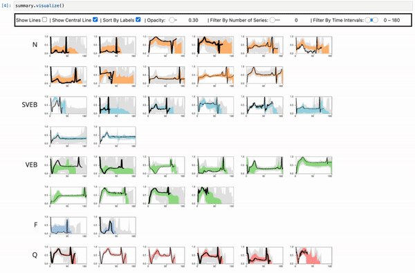

# Jupyter-Time-Series-Visualization
Scalable Time Series Visualization in Jupyter Notebook


## Installation

 1. Follow carefully the installation guide to install [vispy](https://vispy.org/installation.html) with its Jupyter extension (refer to the [notebook](https://vispy.org/installation.html#jupyter-notebook-extension) or [JupyterLab](https://vispy.org/installation.html#jupyterlab) sections).
 2. Check whether you can run vispy successfully by running the following code in Jupyter (you should be able to see a simple line chart):
 ```
import numpy as np

from vispy import plot as vp
from vispy.io import load_data_file

data = np.load(load_data_file('electrophys/iv_curve.npz'))['arr_0']
time = np.arange(0, data.shape[1], 1e-4)

fig = vp.Fig(size=(800, 800), show=False)

x = np.linspace(0, 10, 20)
y = np.cos(x)
line = fig[0, 0].plot((x, y), symbol='o', width=3, title='I/V Curve',
                      xlabel='Current (pA)', ylabel='Membrane Potential (mV)')
grid = vp.visuals.GridLines(color=(0, 0, 0, 0.5))
grid.set_gl_state('translucent')
fig[0, 0].view.add(grid)

fig.show(run=True)
 ```

 3. Install the remaining dependencies: ``` pip install sect shapely tqdm```
 4. To use the library, simply copy the `TSVis` folder to your working directory.
 
 ## Usage
 - Basic Usage
 ```
from TSVis.widget import TimeSeriesVis
import numpy as np
data = [
    #four time series in the first chart
    np.array([[1,2,3,4,5],
              [1,0,1,0,1],
              [2,2,2,2,2],
              [5,1,5,1,5]]),
    #three time series starting from t = 3 in the second chart
    np.array([[np.nan,np.nan,3,4,5],
              [np.nan,np.nan,5,4,3],
              [np.nan,np.nan,2,2,1]]), 
]
vis = TimeSeriesVis()
vis.fit(data) #prepare the buffers
 ```
 ```
 vis.visualize() #launch the widget in another cell
 ```
 
 - More detailed parameters
```
from TSVis.synthetic_data import generateSyntheticData
from TSVis.widget import TimeSeriesVis
import numpy as np

#some synthetic data with different trends
data = generateSyntheticData(50,40) 

#center line for each chart
cl = [random.choice(_d) for _d in data]

#labels for each chart
labels = ['blue','blue','blue','orange','red']

vis = TimeSeriesVis(
    #x domain labels (useful for specifying date)
    x_domain = np.arange(40),
    #number of columns
    n_cols=3,
    #chart width (px)
    chart_width=300,
    #chart height (px)
    chart_height=150,
    #padding between charts (px)
    padding=50,
    #number of x,y ticks
    n_ticks=5,
    #number of bins in density map (~resolution)
    interpolate=200
)
```
```
vis.fit(
    data,
    central_line=cl,
    labels=labels
)
```

## Contact
For more questions or feature requests, feel free to reach me (Gromit Chan) through my [e-mail](mailto:gromit.chan@nyu.edu?subject=[TSVis]%20Source%20Han%20Sans).